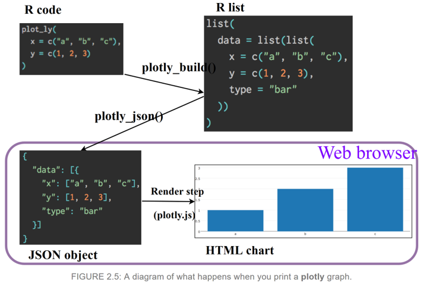
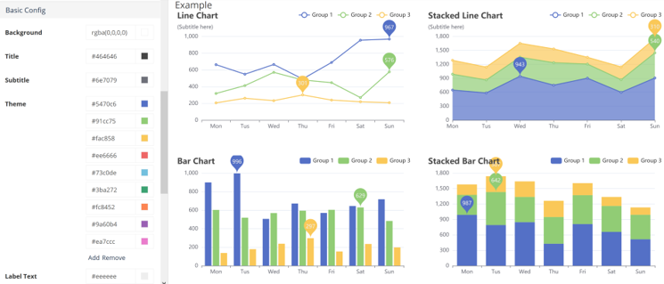

```{r setup, include=FALSE}
knitr::opts_chunk$set(echo = TRUE)
library(plotly)
library(rmarkdown)
library(echarts4r)
library(readr)

# load data
cases <- read_csv("covid_data.csv")
mh <- read_csv("mhtreatment_data.csv")
```

## Learning objectives
- What are interactive plots/graphs?
- When it’s appropriate to use interactive visualisations over static and vice versa
- Basic uses of plotly and echarts4r packages 
- How to refer to JS documentation to add extra functionality to your plots
- How to present your interactive plots in Rmarkdown documents or Shiny apps

## What are interactive plots?

An interactive charts allows the user to perform actions such as zooming, hovering over a marker to get values, choosing a variable to display and more. [Some examples here](https://r-graph-gallery.com/interactive-charts.html). 

Interactive plot libraries include "plotly", "highcharts", "echarts4r", "leaflet" for mapping, "networkD3" for network graphs, and more. We will be going through plotly and echarts4r today. 


## When to use interactive plots

Static plots made using ggplot2 are easily customisable and can be used for most occasions. However, if you want any of the following, you may want to consider creating an interactive plot:

- If your plot has many data points/bars and you want the user to be able to see the exact values on hover
- If your plot has a lot of data you want to show and you want the viewer to interact with it for more detail instead of showing it all at once.
- If you want the viewer to be able to filter the plot by period or another variable
- If you want shared interactivity between several plots. 
- If you want to engage the viewer more with your graph by zooming in, taking a snapshot, etc. 
- They look impressive!

However, there are limitations as well.

- Interactive plot packages tend to be less customisable compared to ggplot2 
- Take up more space 
- Certain functionalities are hard to find in R documentation – many times you will have to refer to original JS documentation!
- Certain functionalities (e.g. buttons in plotly) bug easily although there are workarounds
- Can confuse the viewer if there is too much functionality

## How they work

As you might know, everything is built from JavaScript. 

R packages that produce interactive plots are all built on JavaScript. Take for example the most commonly used package – plotly. Graphs produced using the plotly package in R are powered by the JS library [plotly.js](https://plotly.com/javascript/) (likewise, echarts4r is powered by echarts.js) The functions within the package allows you to utilise the JS interface using R code. Because of this, rendering interactive graphs in static documents like .pdfs and .docx won’t work – it will only work if it is opened in a browser like .html documents, server-hosted shiny apps, and in your local RStudio viewer. 



## Training instructions

All the data and scripts you need are in the project folder (either in RStudio Cloud or in this GitHub repo). The first part of this session will focus on plotly and the second will focus on echarts. 

worksheet.Rmd (this file!) is for you to fill in if you are following along. (recommended)
answersheet.Rmd contains all the code and answers as a reference.

Feel free to use the answer sheet if the session is going too quickly/you missed something! 

## ggplotly

Ggplotly is a function within the plotly package that converts a ggplot2 object into an interactive plotly object. This is good for occasional use, but I recommend creating the plotly object yourself using plotly! 

```{r ggplotly}
plot <- ggplot(iris, aes(x = Sepal.Length, y = Sepal.Width, color = Species)) +   geom_point()
ggplotly(plot)
```

## Plotly basics

Plotly's plotting structure is similar to ggplot in that it is based on layers. The plot_ly() function will call the initial layer and aesthetics of the plot and you can use add_trace() to add additional layers. The layout() function deals with labels, themes, and other cosmetics of the plot which makes it similar to ggplot2::theme(). 

NOTE: add_trace() is just a generalised function for adding layers. You can also use add_bars(), add_lines(), etc. if you want to be specific about the layering. 

### Simple line plot
```{r plotly line1}
cases %>%    
filter(areaName == "England") %>%   
arrange(date) %>%   
plot_ly(x = ~date, y = ~caseRate,           
	type = "scatter", mode = "lines") 

```

### Grouped line plot
```{r plotly line grouped}
cases %>%    
arrange(date) %>%   
plot_ly(x = ~date, y = ~caseRate, color = ~areaName,          
	type = "scatter", mode = "lines") 
```

### Bar plot
```{r plotly bar plot}
cases %>%  
  filter(areaName == "England") %>% 
  arrange(date) %>% 
  plot_ly(x = ~date, y = ~newCasesByPublishDate, type = 'bar') 
```

### Adding line layer
```{r plotly line and bar}
cases %>%   
filter(areaName == "England") %>%   
arrange(date) %>%   
plot_ly(x = ~date, y = ~newCasesByPublishDate, 
	type = "bar", name = "Daily cases") %>%   
add_trace(y = ~rollingAvg, name = "Rolling avg", 
	type = "scatter", mode = "lines")

# Or to be specific with layer types:
cases %>%   
filter(areaName == "England") %>%   
arrange(date) %>%   
plot_ly(x = ~date, y = ~newCasesByPublishDate, 
	type = "bar", name = "Daily cases") %>%   
add_lines(y = ~rollingAvg, name = "Rolling avg")
```

### Adding title and tooltip
```{r plotly layout1}
cases %>% 
  filter(areaName == "England") %>% 
  arrange(date) %>% 
  plot_ly(x = ~date, y = ~newCasesByPublishDate, type = 'bar', name = "Daily cases") %>% 
  add_lines(y = ~rollingAvg, name = "Rolling avg") %>% 
  layout(title = "Positive cases over time", hovermode = "x unified")
```

### Modifying legends
```{r plotly layout2}
cases %>% 
  filter(areaName == "England") %>% 
  arrange(date) %>% 
  plot_ly(x = ~date, y = ~newCasesByPublishDate, type = 'bar', name = "Daily cases") %>% 
  add_lines(y = ~rollingAvg, name = "Rolling avg") %>% 
  layout(title = "Positive cases over time", 
         hovermode = "x unified",
         legend = list(orientation = "h",
                       xanchor = "center", 
                       x = 0.5),
         xaxis = list(title = ""))
```

### Changing marker colour
```{r plotly layout3}
cases %>% 
  filter(areaName == "England") %>% 
  arrange(date) %>% 
  plot_ly(x = ~date) %>% 
  add_bars(y = ~newCasesByPublishDate, name = "Daily cases", 
          marker = list(color = "#5694ca")) %>% 
  add_lines(y = ~rollingAvg, name = "Rolling avg", line = list(color = "#003078")) %>% 
  layout(title = "Positive cases over time", 
         hovermode = "x unified",
         legend = list(orientation = "h",
                       xanchor = "center", 
                       x = 0.5),
         xaxis = list(title = ""))
```

### Editing modebar
```{r plotly modebar}
cases %>% 
  filter(areaName == "England") %>% 
  arrange(date) %>% 
  plot_ly(x = ~date, y = ~newCasesByPublishDate, type = 'bar', 
          name = "Daily cases", 
          marker = list(color = "#72ceff")) %>% 
  config(modeBarButtonsToRemove = c("zoomIn2d", "zoomOut2d", "select2d", "lasso2d"))

# refer here for a full list of modebar buttons: https://github.com/plotly/plotly.js/blob/master/src/components/modebar/buttons.js

```

### Exercise 1

Using the 'cases' dataset given to you, make a bar plot showing daily COVID cases over time in England, with an additional line layer showing the rolling 7-day average over time. Name both layers - "Cases" and " 7-day av)". Finally, add a title. 

[Reference plot](https://coronavirus.data.gov.uk/details/cases?areaType=nation&areaName=England)

Recommended steps:
- Filter dataset to England
- Make first plotly layer with "newCasesByPublishDate" as y and date as x. Name the layer appropriately
- Add line layer with rollingAvg as y. Name the layer appropriately.
- Add title

BONUS: 
- Change the line colour to "#003078" 
- Change hovermode to "x unified"
- Move legend to the bottom. 

```{r exercise 1}


```

### Adding buttons and dropdowns
To add this functionality you will need to utilise JS properties, so the R code will seem a bit more complicated, because we will be "creating" the button and menu structures. You will use lists objects a lot because it is the most complex R object that can contain multiple elements of multiple types. 

"restyle": modify data or data attributes
"relayout": modify layout attributes
"update": modify data and layout attributes

More guidance and example code here: 
https://plotly.com/r/custom-buttons/
https://plotly.com/r/reference/

In this example we will use restyle method to modify the "type" into either "bar" or "scatter"

```{r plotly buttons1}
# make buttons using lists. For this example we are using method = "restyle" 
button_list <- list(
  list(
    method = "restyle",
    args = list("type", "bar"),  # first button with label "Bar" that changes type to "bar"
    label = "Bar"
  ),
  list(
    method = "restyle",
    args = list("type", "scatter"), # second button with label "Scatter" that changes type to "scatter"
    label = "Scatter"
  ))

cases %>% 
  filter(areaName == "England") %>% 
  arrange(date) %>% 
  plot_ly(x = ~date, y = ~newCasesByPublishDate, type = "bar",
          name = "Cases") %>% 
  layout(updatemenus = list( # to add these buttons, use updatemenus arg
    list(
      type = "buttons", 
      y = 0.8,  #placement of buttons on y axis
      buttons = button_list # add in list that we created previously
    )
  ))
```

In this example we will use restyle method to modify a new element "transforms.value" into either "England" or "Hertfordshire". 

```{r plotly buttons2}
button_list <- list(
  list(
    method = "restyle",
    args = list("transforms[0].value", "England"),  # first button that transforms value to England
    label = "England"
  ),
  list(
    method = "restyle",
    args = list("transforms[0].value", "Hertfordshire"), # first button that transforms value to Hertfordshire
    label = "Herts"
  ))

cases %>% 
  arrange(date) %>% 
  plot_ly(x = ~date, y = ~newCasesByPublishDate, type = "bar",
          name = "Cases",
          transforms = list( # in order to access the "transforms[0].value" attribute, we must make one.
            list(
              type = "filter", # we want it to transform by filtering...
              target = ~areaName, # the areaName variable..
              operator = '=',  # by equaling..
              value = ~c("England", "Hertfordshire")))) %>% # either England or Hertfordshire. 
  layout(updatemenus = list(
    list(type = 'dropdown', # the updatemenus is a dropdown this time
         active = 0, # first option of England by default (javascript starts from 0 not 1)
         buttons = button_list))) # using the button list we made before
```

## Echarts4r basics

Echarts4r is a relatively less used interactive plotting package but it has some nice visuals compared to plotly and has certain features that are easier to use compared to plotly (and other packages!).

One big benefit to using echarts is that that the syntax is very easy to pick up, even for beginner R users. 

Bear in mind though, if you want to add buttons/dropdowns to your plot and want to add specific structures such as error bars/confidence intervals, plotly is the better choice.

### Simple line plot
```{r echarts line1}
cases %>%  
  filter(areaName == "England") %>% 
  e_charts(x = date) %>% 
  e_line(caseRate)
```

### Grouped bar plot
```{r echarts bar}
cases %>%  
  group_by(areaName) %>% 
  e_charts(x = date) %>% 
  e_line(caseRate)
```

### Adding layers
```{r echarts layers}
cases %>%  
  filter(areaName == "England") %>% 
  e_charts(x = date) %>% 
  e_bar(newCasesByPublishDate) %>% 
  e_line(rollingAvg)
```

## Referring to JS documentation

https://plotly.com/r/reference/
https://echarts.apache.org/en/option.html

Last time when we wanted to change legend positioning in plotly, we had to include a list() in the legend argument. This is the same in echarts and will happen a lot if you are working with interactive plots often. 

This is due to the nature of JS code. When writing R code to “translate” into JS, we need to follow the structure of JS syntax to an extent. To access the full functionalities of these libraries we need to code our additional arguments within lists that are within lists. 


### Adding title, tooltip, legend
```{r echarts layout1}
mh %>% 
  filter(Group == "Male") %>% # Male
  e_charts(Date) %>% # over time
  e_line(value) %>%  
  e_tooltip(trigger = "axis") %>%  #tooltip
  e_title("Male patients in treatment for mental health issues") %>%  #add title 
  e_legend(show = FALSE) %>% # remove legend as it's not needed
  e_line(mean, symbol = "none") #add mean line with symbol = "none"

# Using additional arguments from JS  -------------------------------------

mh %>% 
  filter(Group == "Male") %>% 
  e_charts(Date) %>% 
  e_line(value, # within e_line (R equivalent of series: {type:line})
         lineStyle = list( # lineStyle arg. we input a list of additional args WITHIN lineStyle
           color = "#fe213c" # color arg within lineStyle
         )) %>%  
  e_tooltip(trigger = "axis") %>%  #tooltip
  e_title("Male patients in treatment for mental health issues") %>%  
  e_legend(show = FALSE) %>% 
  e_line(mean, symbol = "none") 
```

### Exercise 2

Using the mh dataset, make an SPC chart (line plot) showing count of male 
mental health patients in treatment over time. Add an additional line for the 
mean. Add two additional lines for the upper and lower confidence intervals. 
Set the tooltip as “axis”.

```{r exercise 2}

```

### EXTRA: Custom themes

Use the e_theme() function to change to any of the preset themes here.

To make your own custom theme with organisational colours, default line width, default symbols, etc., use the [theme builder here](https://echarts.apache.org/en/theme-builder.html). Then just download the .json file, upload to your project, and use e_theme_custom("name_of_your_theme.json")



```{r echarts themes1}
# "westeros" theme
mh %>% 
  filter(Group == "Male") %>% # filter to male patients
  e_charts(Date) %>%# over time
  e_line(value) %>% # first line layer for values
  e_line(mean, symbol = "none") %>%  # second line layer for mean (without symbols)
  e_line(upper_ci, symbol = "none") %>% # third line for upper CI
  e_line(lower_ci, symbol = "none") %>% # fourth line for lower CI
  e_tooltip(trigger = "axis") %>% 
  e_theme("westeros")

# use the custom.json theme provided 
mh %>% 
  filter(Group == "Male") %>% # filter to male patients
  e_charts(Date) %>%# over time
  e_line(value) %>% # first line layer for values
  e_line(mean, symbol = "none") %>%  # second line layer for mean (without symbols)
  e_line(upper_ci, symbol = "none") %>% # third line for upper CI
  e_line(lower_ci, symbol = "none") %>% # fourth line for lower CI
  e_tooltip(trigger = "axis") %>% 
  e_theme_custom("custom.json")
```

### EXTRA: Connecting two graphs

```{r echarts connect}
# make the plot for male patients:
male <- mh %>% 
  filter(Group == "Male") %>% 
  e_charts(Date) %>% 
  e_line(value) %>%  
  e_tooltip(trigger = "axis") %>%  
  e_title("Male") %>%  
  e_line(mean, symbol = "none") %>% 
  e_group("mh") %>% # to connect them, they need the same group ID
  e_y_axis(max = max(mh$value)) # adjusting the y axis so that it's fixed for both

# make the plot female patients:
female <- mh %>% 
  filter(Group == "Female") %>% #
  e_charts(Date) %>%
  e_line(value) %>%  
  e_tooltip(trigger = "axis") %>%  
  e_title("Female") %>%  
  e_line(mean, symbol = "none") %>% 
  e_group("mh") %>%  # same group ID
  e_y_axis(max = max(mh$value)) %>% 
  e_connect_group("mh") # connect this plot with any plots with the same group ID

# use e_arrange to plot them together
e_arrange(male, female, cols = 2)

```

## Other packages

Hopefully this short session has given you some confidence in trying out interactive packages. Plotly and echarts are just two of the many interactive visualisation packages out there available to R users. There are specific packages for making interactive maps, widgets, network graphs, etc as well:

- leaflet – powerful interactive mapping package
- crosstalk – allows linkage between widgets (including plotly and leaflet) and user filters 
- visNetwork - interactive network graphs with lots of user interaction
- networkD3 – another package for interactive network graphs 
- dygraphs
- highcharts
- billboarder
- shiny – if you are building a dashboard / tool with maximum user interactivity, building a shiny app is the way to go. 

## Resources

**Plotly:**

- R help page - https://plotly.com/r/
- Reference page - https://plotly.com/r/reference/
- Book on “Interactive web-based data visualization with R, plotly, and shiny”

**Echarts:**

- R package website - https://echarts4r.john-coene.com/
- Reference page - https://echarts.apache.org/en/option.html

**General inspiration**

https://www.r-graph-gallery.com/

